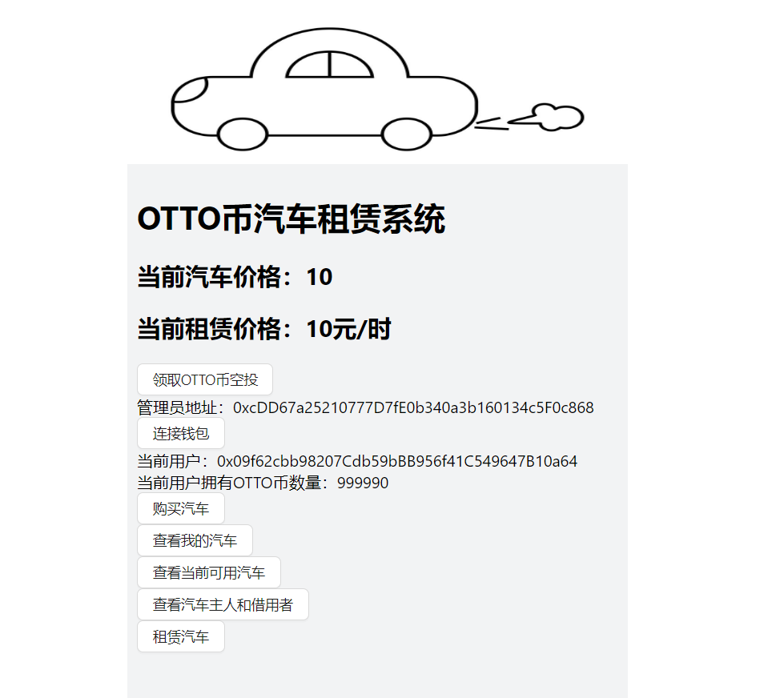
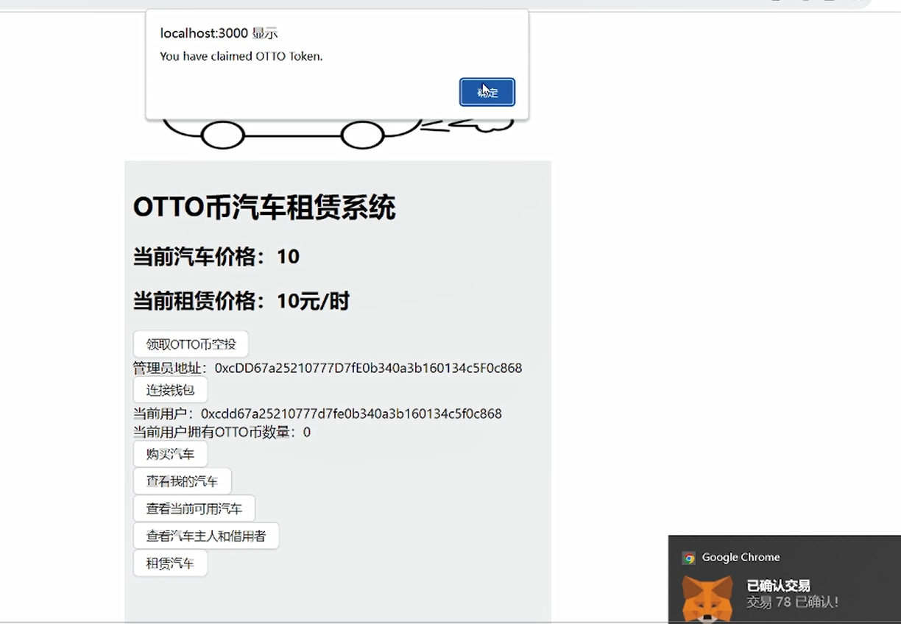
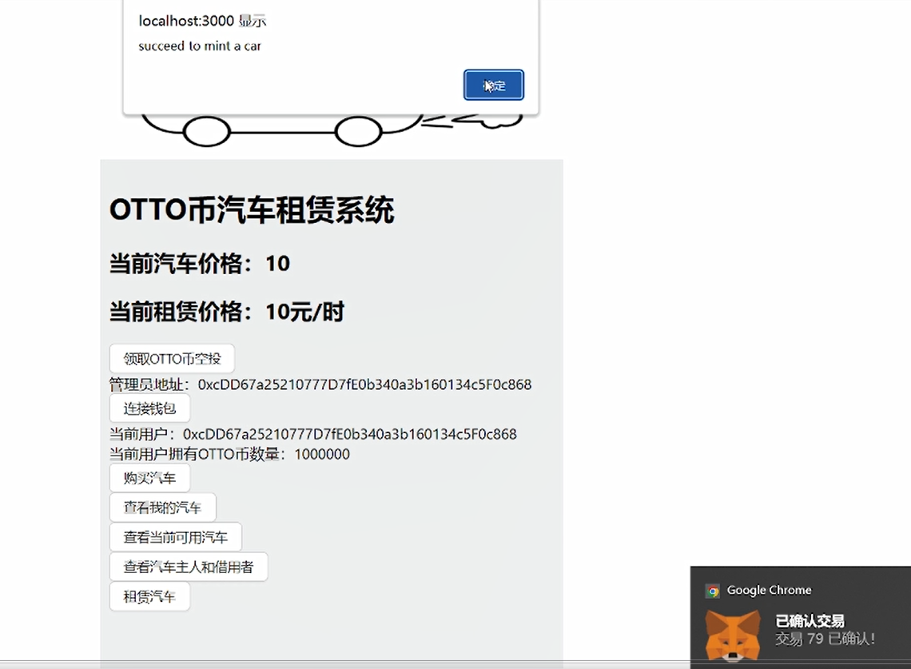
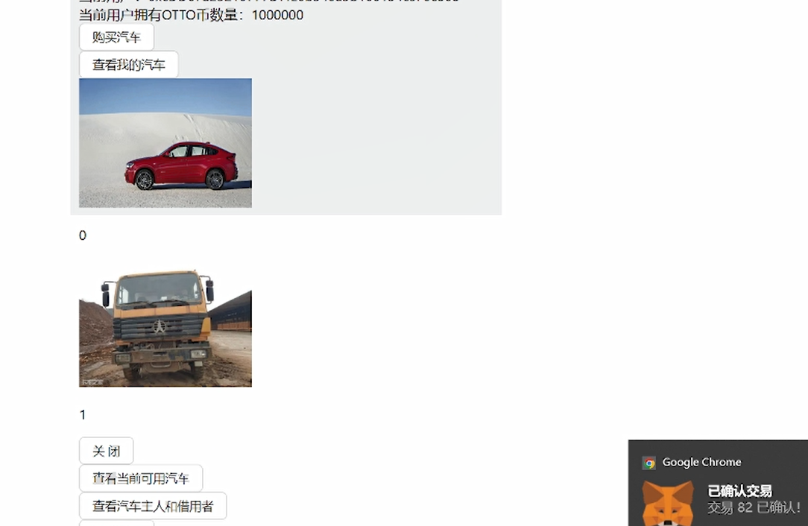
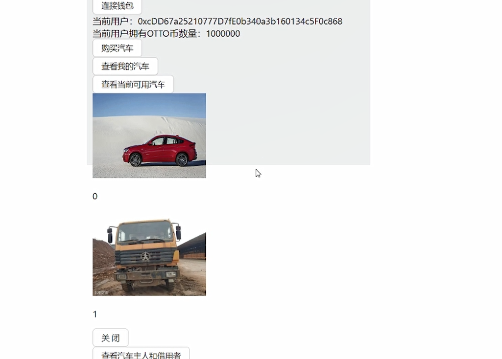
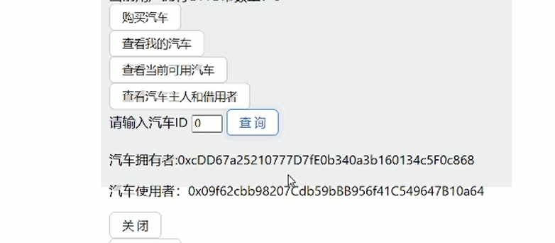
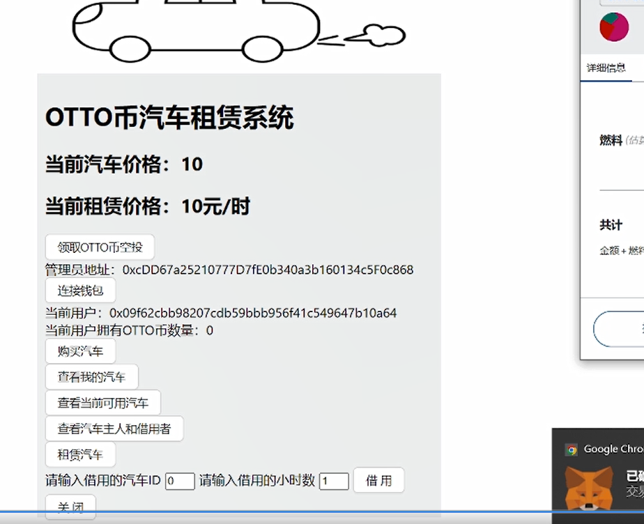

# OTTO币汽车租借系统


> 第二次作业要求（以下内容提交时可以删除）：
> 
> 简易汽车借用系统，参与方包括：汽车拥有者，有借用汽车需求的用户
>
> - 创建BorrowYourCar合约，在合约中发行NFT集合，每个NFT代表一辆汽车。
> - 创建MyERC20合约，用于汽车租借系统中的支付
> - 在网站中，默认每个用户的汽车都可以被借用。每个用户可以： 
>    1. 查看自己拥有的汽车列表。查看当前还没有被借用的汽车列表。
>    2. 查询一辆汽车的主人，以及该汽车当前的借用者（如果有）。
>    3. 选择并借用某辆还没有被借用的汽车一定时间。


## 如何运行

补充如何完整运行你的应用。

1. 在本地启动ganache应用。

2. 在 `./contracts` 中安装需要的依赖，运行如下的命令：
    ```bash
    npm install
    ```
3. 在 `./contracts` 中编译合约，运行如下的命令：
    ```bash
    npx hardhat compile
    ```
4. ...
5. ...
6. 在 `./frontend` 中安装需要的依赖，运行如下的命令：
    ```bash
    npm install
    ```
7. 在 `./frontend` 中启动前端程序，运行如下的命令：
    ```bash
    npm run start
    ```

## 功能实现分析

- 铸造汽车
>使用mint函数实现
- 空投OTTO币
>使用air drop实现
- 连接钱包
>在前端连接小狐狸实现
- 购买汽车
>使用OTTO币为当前账户购买汽车
- 查看我的汽车列表
> 在合约中使用一个map检索当前账户汽车，在前端渲染出来
- 查看当前可用汽车列表
> 在合约中使用两次for循环得到当前可用汽车列表，在前端渲染出来
- 查看汽车主人和借用者
> 在前端输入汽车id，查看该汽车的主人和借用者
- 租赁骑车
> 通过输入汽车id和租赁时间来租赁一定时间的汽车

## 项目运行截图

- 主界面
- 
- 领取空投
- 
- 购买汽车
- 
- 查看我的汽车
- 
- 查看当前可用汽车
- 
- 查看汽车主人和借用者
- 
- 租赁汽车
- 

## 参考内容

- 课程的参考Demo见：[DEMOs](https://github.com/LBruyne/blockchain-course-demos)。

- ERC-4907 [参考实现](https://eips.ethereum.org/EIPS/eip-4907)

